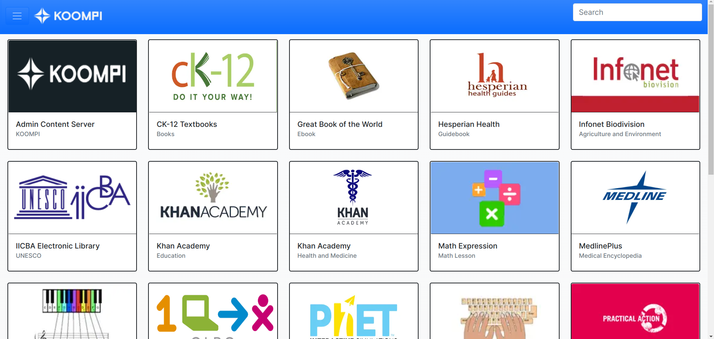
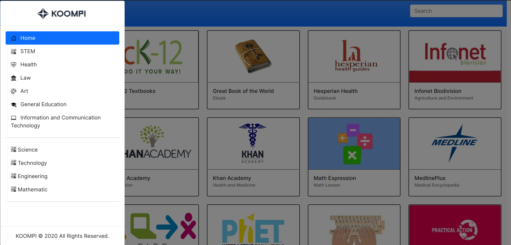

# Local Content Server Gateway Portal

A Unified and fully responsive web page for all websites in Content Server built with Bootstrap 5.1 and pure Javascript without any framework. All contents are staticly generated with json file in [read_json.js](js/read_json.js)

## Download
Clone this project with "git clone"

## Usage

### With LiveServer VSCode Extension
#### Method 1
- Click on index.html
- Right Click on its codes
- Choose "Open with Live Server"
#### Method 2
- Click on "Go Live"

### Without LiveServer VSCode Extension
- Go to the directory location with the default File Explorer
- run the "index.html" file with the default browser

### Demo
- Main Page

- Sidebar

- Item Subcontent
